# PointCloudExporter

Hi! My name is Leon Denise, I’m an independant artist programmer.  
I draw comics, make games, code shaders, hug trees and talk to cows.  
You can visit my portfolio: [leon196.github.io](https://leon196.github.io)  
And my gif gallery: [giphy.com/leondenise](https://giphy.com/leondenise)

In this tutorial, I’m going to explain how I did the [Simon Splash](https://sketchfab.com/models/23ca1c9754444c2d85af5c31684bd81f).

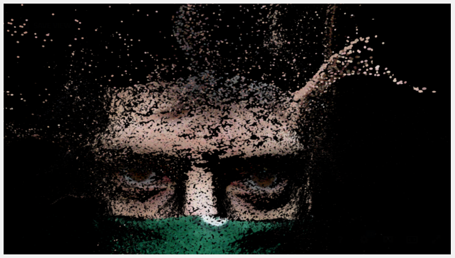

The point cloud data was made with [Agisoft Photoscan](http://www.agisoft.com/).  
The mesh was generated with [Unity3D](http://unity3d.com/).

# About the project

The project is a point cloud tool used for generative art. It is a real-time software that generates triangle particles from a point cloud and displace them in a vector field with specific rules for velocity behavior. The tool also export the generated particles into a standard 3d mesh and bake the vertex colors into a map with generated texture coordinates.

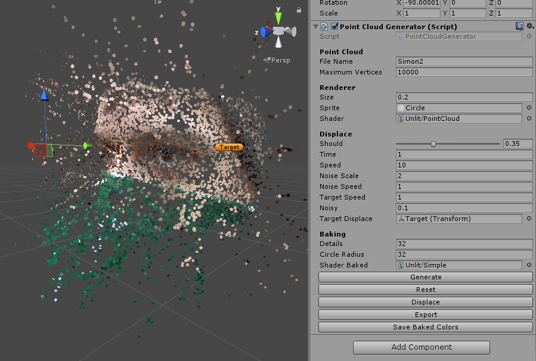
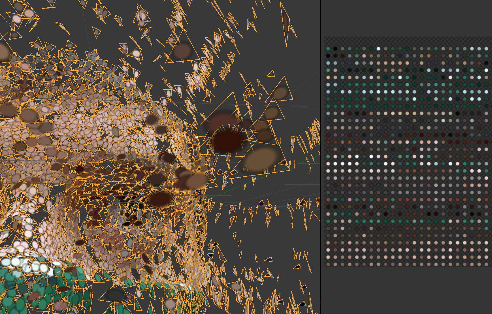

## The motivation

The motivation came from the fact that point cloud viewers are not very advanced, since point clouds are not the real matter of 3d worlds such as video games. When you zoom in, points stay as dots, it creates to me a frustration that needs to be satisfied.

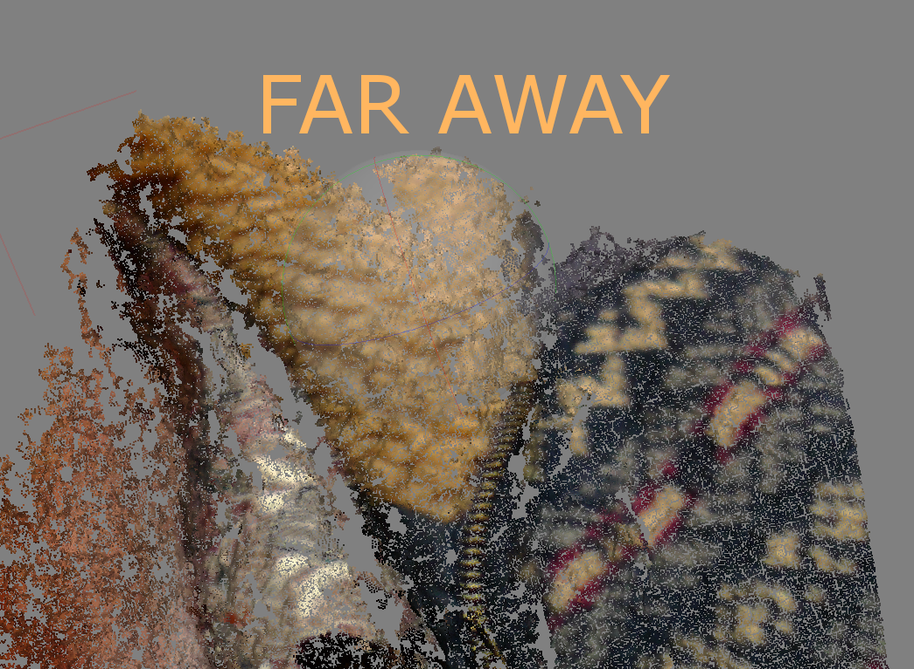
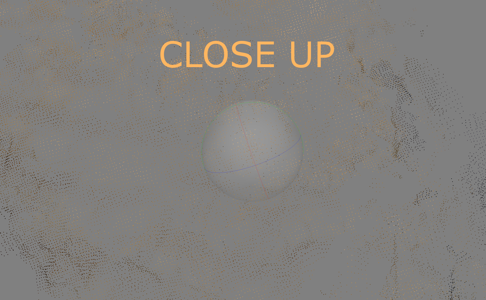

So I’ve coded a program that generate triangles from the dots, taking position, normal and color. I’m sharing the source code of the program, it’s a simplified version (no GPU particles) of my point cloud engine. For the sake of comprehension and because the advanced version is part of a commercial project.

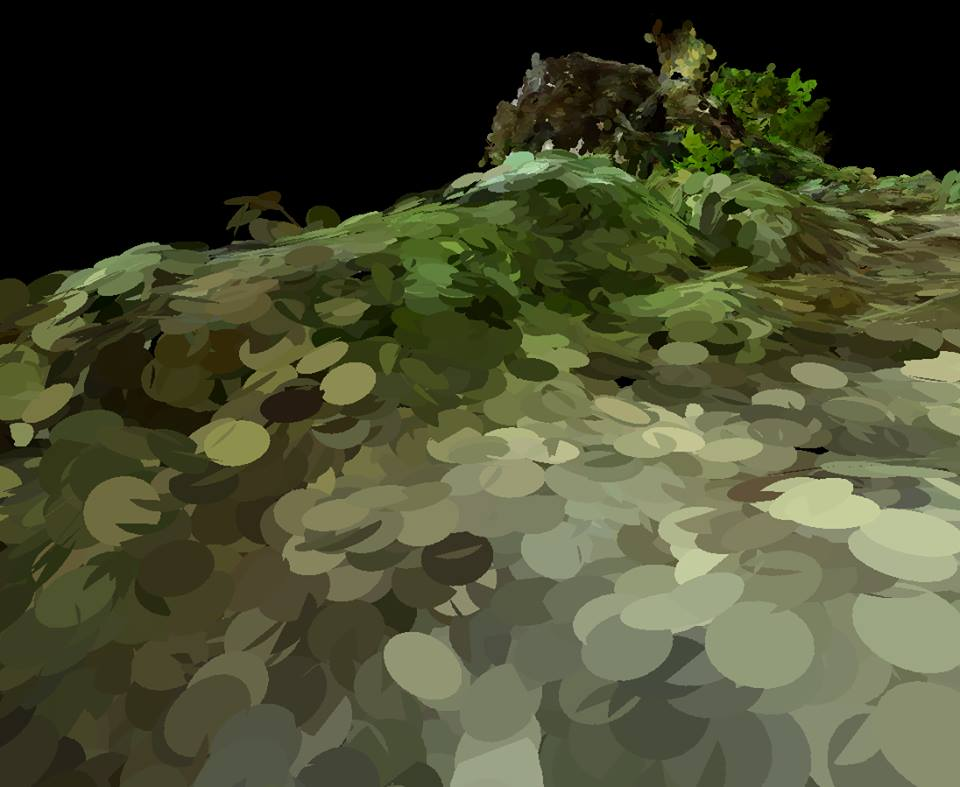
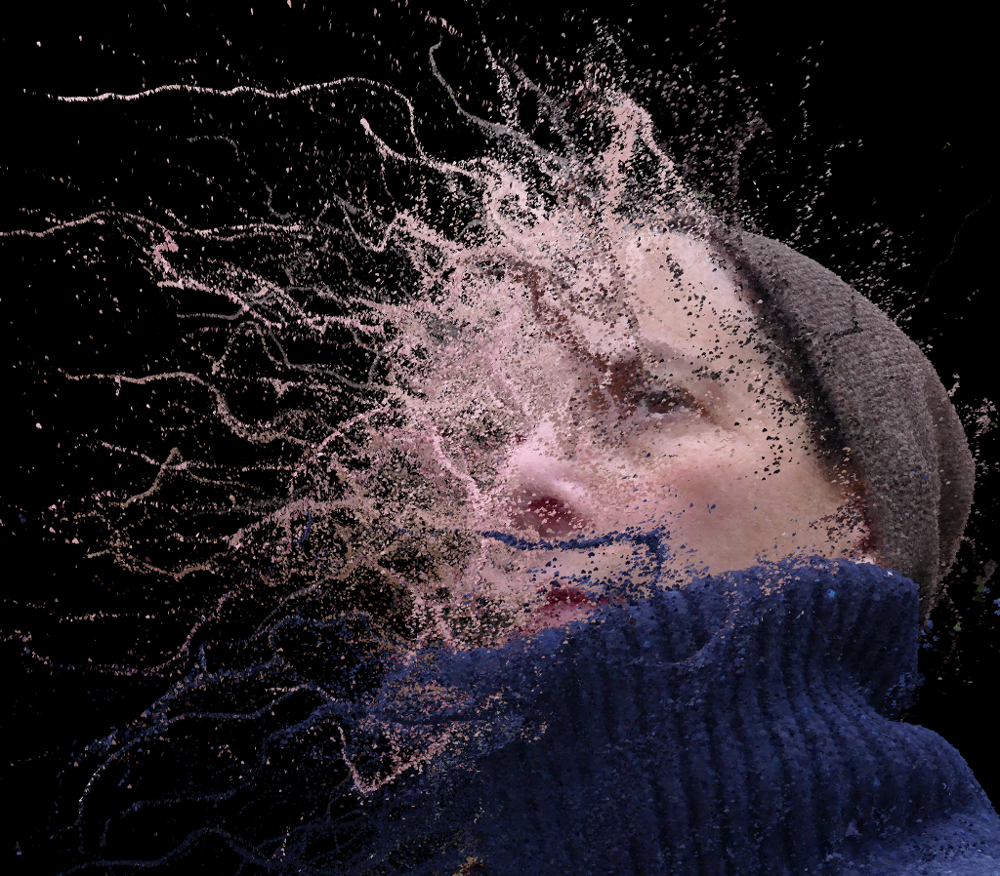

## How to
### Export a point cloud
After you have generated a point cloud in your favourite software, export it as PLY format:
binary encoding with position, normal and color.

Exemples with Agisoft Photoscan and MeshLab:  

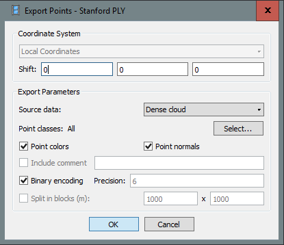
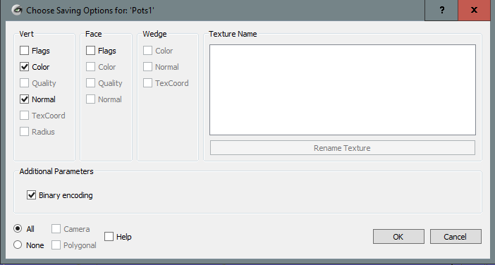

My PLY importer C# script is pretty naive and there is chances that it won’t work with a PLY exported from a different software. If you improve the importer script, and like to share, do not hesitate to send a pull request on the git repository.

### Start the Unity3D project
Download, install Unity3D.  
You will find the scripts and shaders used to generate triangle mesh from a point cloud.  
The main script is **PointCloudGenerator**.

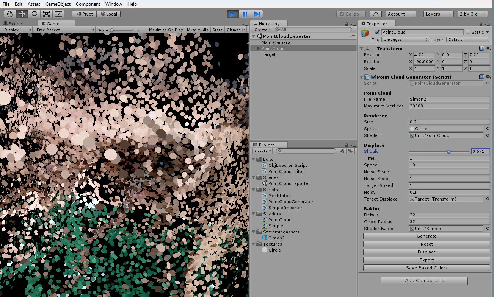

If you don’t know about Unity3D, the official documentation is great and there is plenty tutorial resources over the web. To use the tool, open the scene “PointCloudExporter”. Start the play button, select the PointCloud game object in the hierarchy window, so you can adjust parameters in the inspector window.

### Change parameters

#### Load parameters

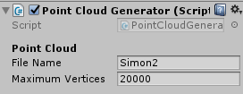

PointCloudGenerator will load a file in the StreamingAssets folder and automatically adds the .ply extension.  
That’s why **File Name** is just “Simon2”.  
You can adjust the **Maximum Vertices** count to get more details.  

#### Renderer parameters

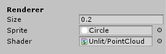

**Size** is the radius of the triangle.  
**Sprite** allows you to choose a texture for the triangle.  

##### About the sprite

The texture used for the sprite must have **clamp wrap mode** and **disabling mipmapping** give better results. Since we use triangles instead of quads for performance, the UV mapping is sized to cover the triangle.  

On the left, sprite with clamp wrap mode. On the right, sprite with repeat wrap mode.  

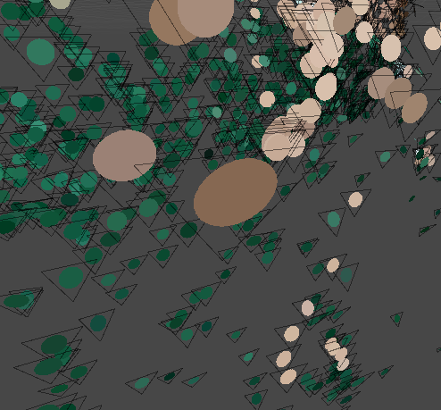
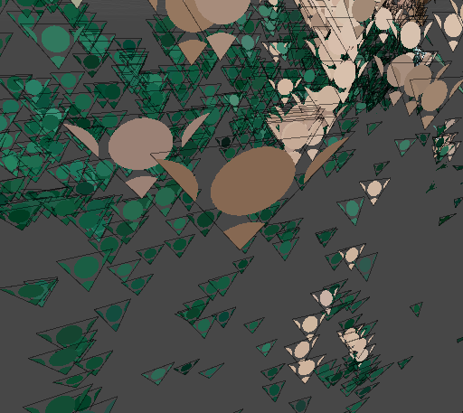

##### About the shader
You can check the **Shader** code used to generate triangles. (warning: geometry shader stuff)  

If you inspect the “Generate” function in the PointCloudGenerator script, there is a part where it creates mesh with point topology. So the script create a mesh with no triangles, only points. Then a geometry shader is generating triangle from point.  

If you change the shader for “Unlit/Color” for example, you will get this render: points.

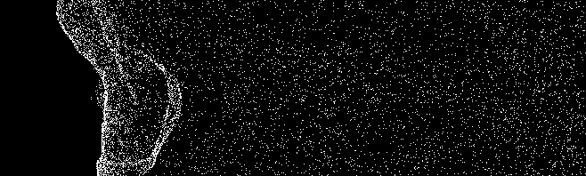

With the PointCloud shader, you will get this render: triangles with color and direction.  

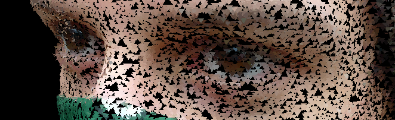

Here is a scary screenshot with hieroglyph characters known as shader language code. That part shows a function that create a triangle from a point: a geometry shader.

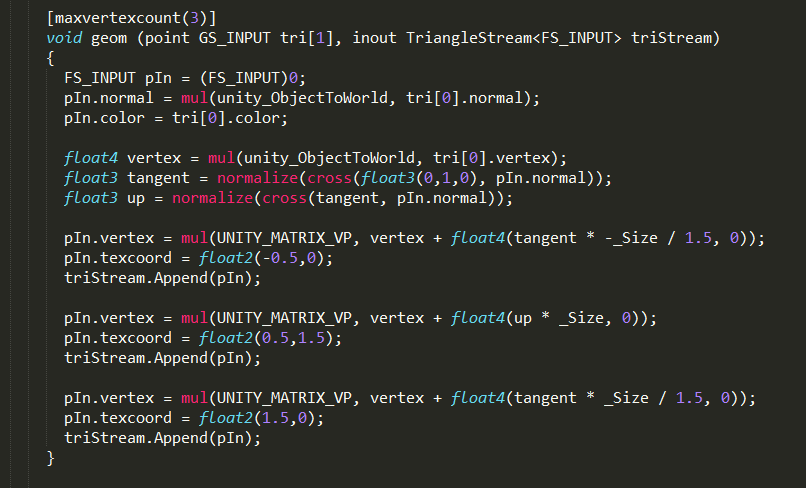

The challenge is to display triangles that will face a certain direction. Manipulating vertex in a shader is about parallelism and knowing if a point in space belong to a triangle requires storing data into vertices. I’m using geometry shader mainly because you can not setup custom attributes for vertices in Unity3D. (There are tricks, but let’s keep it simple for this tutorial)

### Displace parameters

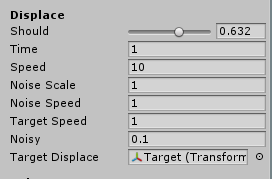

**Should** is the ratio that selects which particles should be displaced.  
**Time** is the duration of the displacement.  
**Speed** is the velocity unit.  
**Noise** Scale is the level of details of the Perlin noise.  
**Noise** Speed is the coefficient of the noise offset.  
**Target** Speed is the coefficient of the target offset.  
**Noisy** is like salt, it adds a grain to coefficients.  

The displacement behaviour can be found in the “Displace” function. This simple version is about two vectors: a smooth random direction and moving away from a point in space. This is where you can adjust and customize the displacement behaviour.  

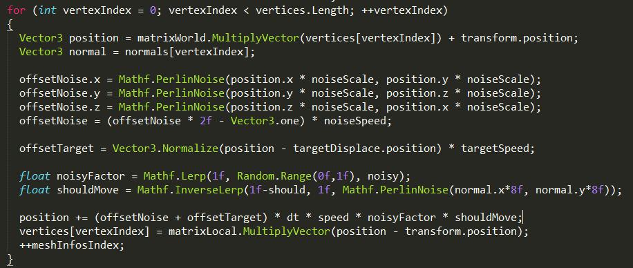

### Baking parameters

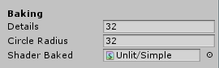

**Details** is a sort of level of details for color.  
**Circle** Radius is the size of the color on the map.  
**Shader** Baked is the shader to use when triangle mesh is generated.  

A baked map with 4 as details.

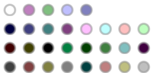

A baked map with 16 as details.

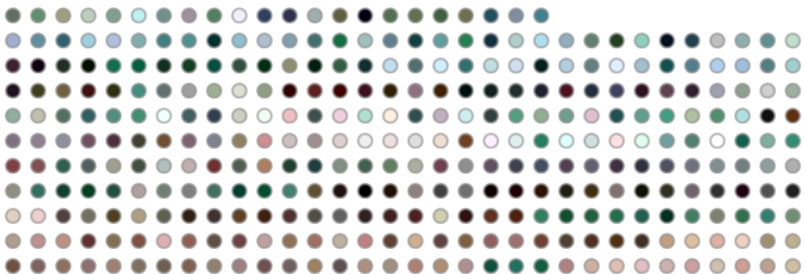

Because you can’t always have custom shader, you can’t set the triangle color from the vertices color attribute. That’s why this tool have a baking map colors, so the mesh can be imported on Sketchfab or any 3d viewer. If you inspect the baked mesh, you will find the generated texture coordinates.  

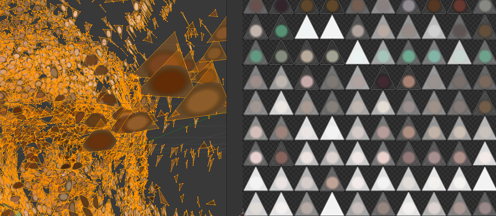

### Action buttons

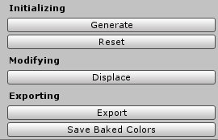

**Generate** is triggered when pressing start button, and can be used to reload point cloud.  
**Reset** will move the vertices to their original positions.  
**Displace** will start a displacement sequence, with the chosen parameters.  
**Export** will create a mesh ready to be exported. (it does not create a file on the disk)  
**Save Baked Colors** will open a save dialog window, asking where you write the texture file.  

To export the model, you have to press the export button. It will create a triangle topology mesh that will replace the point topology mesh. Then you can use the script [ExportOBJ](http://wiki.unity3d.com/index.php?title=ExportOBJ) from the UnifyCommunity, that is already in the project. It works like this: select any game object, click through File / Export / Wavefron OBJ.

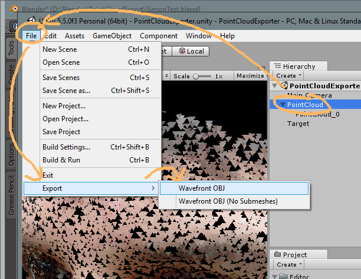

If everything worked out, you should be able to import it in you favourite 3D software, and then share it on Sketchfab!

## Voilà !

I hope it will work at the first try for your point cloud data. It’s an open source work in progress project, so there is unstable code, optimizable algorithm and performance issues.  
Also after an export, you will have to generate again a point topology mesh, to be able to displace again. There is a lot of things that could be improved.  

Thanks for reading through this whole article. You can find more open source resources and personnal projects on my little compilation repository: [github.com/leon196/Workshop](https://github.com/leon196/Workshop)  
Also I’m spamming gifs on Twitter: [twitter.com/leondenise](https://twitter.com/leondenise)
